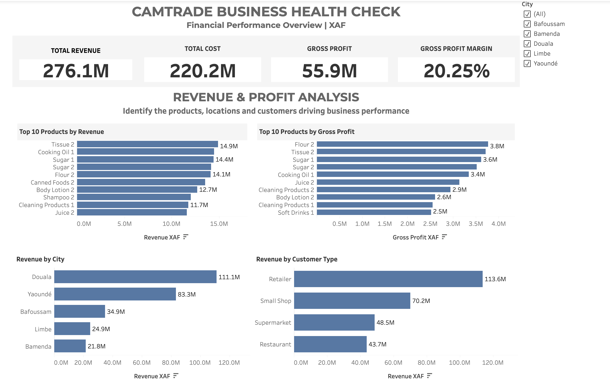

## CAMTRADE Business Health Check

### Business Intelligence & Sales Performance Analysis

This project analyzes the financial and commercial performance of CAMTRADE across products, locations, and customer segments.

The objective is to turn business data into clear insights that can support better decisions around sales performance, profitability, markets, and customers.

### Business Objective

The analysis focuses on four key questions:

- How is the business performing financially?
- Which products generate the most revenue and gross profit?
- Which locations contribute most to revenue?
- Which customer segments generate the most revenue?

### Dashboard

The interactive Tableau dashboard provides an overview of:

- Total Revenue
- Total Cost
- Gross Profit
- Gross Profit Margin
- Top 10 Products by Revenue
- Top 10 Products by Gross Profit
- Revenue by City
- Revenue by Customer Type
- ## Key Performance Results

| KPI | Result |
|---|---:|
| Total Revenue | 276.1M XAF |
| Total Cost | 220.2M XAF |
| Gross Profit | 55.9M XAF |
| Gross Profit Margin | 20.25% |

## Key Business Insights

### 1. Revenue is concentrated in Douala

Douala generates approximately 40% of total revenue, making it the strongest market in the analysis.

**Recommendation:** Protect the strong Douala market while investigating the factors limiting revenue growth in other locations.

### 2. Revenue does not always equal profitability

The highest-revenue product is not necessarily the product generating the highest gross profit.

**Recommendation:** Evaluate products using both revenue and gross profit when making product and sales decisions.

### 3. Retailers are the largest customer segment

Retail customers generate the highest revenue among the customer segments analyzed.

**Recommendation:** Analyze retailer purchasing patterns to identify opportunities for retention, targeted sales, and growth.

### 4. Gross profit margin provides a profitability baseline

The overall gross profit margin is 20.25%.

**Recommendation:** Monitor gross profit margin by product, location, and customer segment to identify areas requiring pricing or cost attention.
## Tools & Technologies

- Tableau — Interactive dashboard development and data visualization
- SQL / Data Analysis — Business-focused data analysis
- Data Modeling — Relationships between sales, customers, and products
- Business Intelligence — KPI development and performance analysis

## Data Model

The analysis uses four main business tables:

- **Sales** — transactions, revenue, cost, gross profit, city, and customer type
- **Customers** — customer information and customer segments
- **Products** — product, category, cost, and selling price information
- **Expenses** — business expenses by category, city, and date

Relationships were established between the Sales, Customers, and Products tables to support the analysis while avoiding unnecessary duplication of data.

## Skills Demonstrated

- KPI development
- Tableau dashboard design
- Interactive dashboard filtering
- Sales and profitability analysis
- Product performance analysis
- Geographic performance analysis
- Customer segmentation
- Business insight generation
- Data-driven recommendations
- ## Interactive Dashboard

## Interactive Dashboard

View the interactive Tableau dashboard:

[View the CAMTRADE Business Health Check Dashboard](https://public.tableau.com/app/profile/agbor.ofonde.ntui/viz/SampleAnalysis_17878454591860/Dashboard1)
